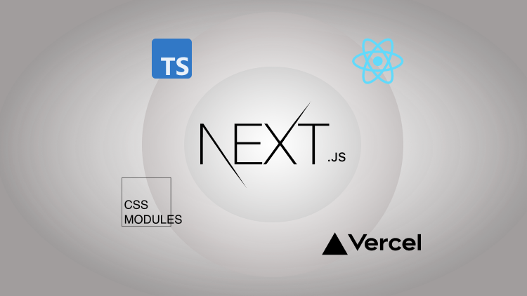

  
 
 
 

⏱ No time-waste: everything under 40minutes ⏱

📚 All fundamentals are covered

🧠 No hard rails to follow or strict tutorials

📦 Minimal number of dependencies to a **smooth learning curve**

 

## This is a free course on Udemy

> 🔥 Get access to all videos, lessons, and references by enrolling for **free**

🇧🇷[Português: NextJS Desde o começo](https://www.udemy.com/course/nextjs-desde-o-comeco/?referralCode=9D036C2B49D938FF6436)

🇺🇸[English: NextJS Up and Running](https://www.udemy.com/course/nextjs-up-and-running/?referralCode=4F70682831255C3E8A55)

---

👀 also check [atila.io](https://atila.io) for more content
